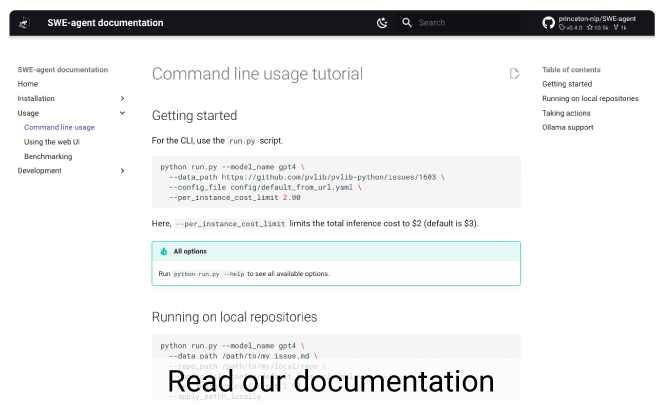

<p align="center">
  <a href="https://www.swe-agent.com/">
    
  </a>
</p>


<p align="center">
  <a href="https://swe-agent.com"><strong>Website & Demo</strong></a>&nbsp; | &nbsp;
  <a href="https://princeton-nlp.github.io/SWE-agent/"><strong>Documentation</strong></a>&nbsp; | &nbsp;
  <a href="https://discord.gg/AVEFbBn2rH"><strong>Discord</strong></a>&nbsp; | &nbsp;
  <a href="https://swe-agent.com/paper.pdf"><strong>Preprint</strong></a>
</p>


## 👋 Overview <a name="overview"></a>
SWE-agent turns LMs (e.g. GPT-4) into software engineering agents that can fix bugs and issues in real GitHub repositories.

On [SWE-bench](https://github.com/princeton-nlp/SWE-bench), SWE-agent resolves **12.29%** of issues, achieving the state-of-the-art performance on the full test set.

We accomplish our results by designing simple LM-centric commands and feedback formats to make it easier for the LM to browse the repository, view, edit and execute code files. We call this an 🤖 **Agent-Computer Interface (ACI)**.
Read more about it in our [paper](https://swe-agent.com/paper.pdf)!

SWE-agent is built and maintained by researchers from Princeton University.

<p align="center">
  
</p>

If you found this work helpful, please consider using the following citation:
```
@misc{yang2024sweagent,
      title={SWE-agent: Agent-Computer Interfaces Enable Automated Software Engineering},
      author={John Yang and Carlos E. Jimenez and Alexander Wettig and Kilian Lieret and Shunyu Yao and Karthik Narasimhan and Ofir Press},
      year={2024},
}
```

### ✨ Use SWE-agent as a dev tool

We provide a command line tool and a graphical web interface:


## 🚀 Get started!

All information is provided in our [documentation][docs]:

* [Installation](https://princeton-nlp.github.io/SWE-agent/installation/)
* [Command line usage](https://princeton-nlp.github.io/SWE-agent/usage/cl_tutorial/)
* [Using the web UI](https://princeton-nlp.github.io/SWE-agent/usage/web_ui/)
* [Benchmarking on SWE-bench](https://princeton-nlp.github.io/SWE-agent/usage/benchmarking/)

and many more topics.

<div align="center">
<a href="https://princeton-nlp.github.io/SWE-agent/"></a>
</div>

[docs]: https://princeton-nlp.github.io/SWE-agent/

## 💫 Contributions <a name="contributions"></a>
- If you'd like to ask questions, learn about upcoming features, and participate in future development, join our [Discord community](https://discord.gg/AVEFbBn2rH)!
- If you'd like to contribute to the codebase, we welcome [issues](https://github.com/princeton-nlp/SWE-agent/issues) and [pull requests](https://github.com/princeton-nlp/SWE-agent/pulls)!
- If you'd like to see a post or tutorial about some topic, please let us know via an [issue](https://github.com/princeton-nlp/SWE-agent/issues).

Contact person: [John Yang](https://john-b-yang.github.io/) and [Carlos E. Jimenez](http://www.carlosejimenez.com/) (Email: {jy1682, carlosej}@princeton.edu).

## 🪪 License <a name="license"></a>
MIT. Check `LICENSE`.

<div align="center">

[](https://github.com/princeton-nlp/SWE-agent/actions/workflows/pytest.yaml)
[](https://github.com/princeton-nlp/SWE-agent/actions/workflows/test_build_containers.yaml)
[](https://github.com/princeton-nlp/SWE-agent/actions/workflows/release-dockerhub.yaml)
[](https://github.com/princeton-nlp/SWE-agent/actions/workflows/build-docs.yaml)
[](https://codecov.io/gh/princeton-nlp/SWE-agent)
[](https://results.pre-commit.ci/latest/github/princeton-nlp/SWE-agent/main)
[](https://github.com/princeton-nlp/SWE-agent/actions/workflows/check-links.yaml)

</div>
