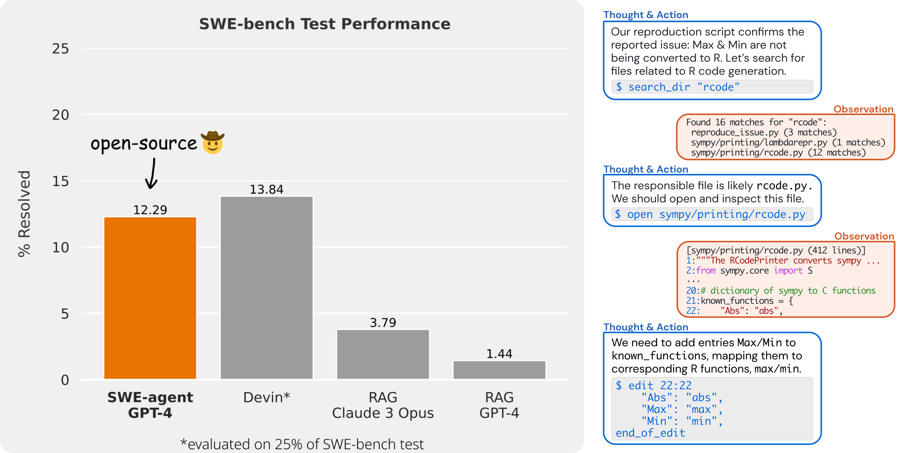

<p align="center">
  <a href="https://www.swe-agent.com/">
    
  </a>
</p>


<p align="center">
  <a href="https://swe-agent.com"><strong>Website & Demo</strong></a>&nbsp; | &nbsp;
  <a href="https://discord.gg/AVEFbBn2rH"><strong>Discord</strong></a>&nbsp; | &nbsp;
  <strong>Paper [coming April 10th]</strong>
</p>


## 👋 Overview <a name="overview"></a>
SWE-agent turns LMs (e.g. GPT-4) into software engineering agents that can fix bugs and issues in real GitHub repositories.

On [SWE-bench](https://github.com/princeton-nlp/SWE-bench), SWE-agent resolves **12.29%** of issues, achieving the state-of-the-art performance on the full test set.

SWE-agent is built and maintained by researchers from Princeton University. 

<p align="center">
  
</p>

### ✨ Agent-Computer Interface (ACI) <a name="aci"></a>
We accomplish these results by designing simple LM-centric commands and feedback formats to make it easier for the LM to browse the repository, view, edit and execute code files. We call this an **Agent-Computer Interface** (ACI) and build the SWE-agent repository to make it easy to iterate on ACI design for repository-level coding agents.

Just like how typical language models requires good prompt engineering, good ACI design leads to much better results when using agents. As we show in our paper, a baseline agent without a well-tuned ACI does much worse than SWE-agent.

SWE-agent contains features that we discovered to be immensely helpful during the agent-computer interface design process:
1. We add a linter that runs when an edit command is issued, and do not let the edit command go through if the code isn't syntactically correct.
2. We supply the agent with a special-built file viewer, instead of having it just ```cat``` files. We found that this file viewer works best when displaying just 100 lines in each turn. The file editor that we built has commands for scrolling up and down and for performing a search within the file.
3. We supply the agent with a special-built full-directory string searching command. We found that it was important for this tool to succintly list the matches- we simply list each file that had at least one match. Showing the model more context about each match proved to be too confusing for the model. 
4. When commands have an empty output we return a message saying "Your command ran successfully and did not produce any output."

Read our paper for more details [coming soon!].

```
@misc{yang2024sweagent,
      title={SWE-agent: Agent Computer Interfaces Enable Software Engineering Language Models}, 
      author={John Yang and Carlos E. Jimenez and Alexander Wettig and Shunyu Yao and Karthik Narasimhan and Ofir Press},
      year={2024},
}
```

## 🚀 Setup <a name="setup"></a>

### 🏎️ Express Setup + Run

You can run the software directly using Docker. 

1. [Install Docker](https://docs.docker.com/engine/install/), then start Docker locally.
2. Run `docker pull sweagent/swe-agent:latest`
3. Add your API tokens to a file `keys.cfg` as explained [below](#-add-your-api-keystokens)

Then run

```bash
# Please remove all comments (lines starting with '#') before running this command!
docker run --rm -it -v /var/run/docker.sock:/var/run/docker.sock \
  # replace /xxxx/keys.cfg with the paths to your keys
  -v /xxxx/keys.cfg:/app/keys.cfg
  sweagent/swe-agent-run:latest \
  python run.py --image_name=sweagent/swe-agent:latest \
  # the rest of the command as shown in the quickstart/benchmarking section,
  # for example to run on a specific github issue
  --model_name gpt4 \
  --data_path https://github.com/pvlib/pvlib-python/issues/1603 \
  --config_file config/default_from_url.yaml  --skip_existing=False
```

> [!TIP]
> * For more information on the different API keys/tokens, see [below](#-add-your-api-keystokens).
> * If you're using docker on Windows, use `-v //var/run/docker.sock:/var/run/docker.sock`
>   (double slash) to escape it ([more information](https://stackoverflow.com/a/47229180/)).

### 🐍 Setup with conda (development version) 

To install the development version:

1. [Install Docker](https://docs.docker.com/engine/install/), then start Docker locally.
2. Clone this repository
3. [Install Miniconda](https://docs.anaconda.com/free/miniconda/miniconda-install/), then create the `swe-agent` environment with `conda env create -f environment.yml`
4. Activate using `conda activate swe-agent`.
5. Run `./setup.sh` to create the `swe-agent` docker image.
6. Create a `keys.cfg` file at the root of this repository ([see below](#-add-your-api-keystokens))

> [!WARNING]
> Expect some issues with Windows (we're working on them).
> In the meantime, simply use Docker (see above).
> If you want the latest version, you can also build your own `swe-agent-run`
> container with the `Dockerfile` at the root of this repository by running
> `docker built -t sweagent/swe-agent-run:latest .`

### 🔑 Add your API keys/tokens

For the conda setup, create a `keys.cfg` file at the root of this repository and populate it with your API keys.

```
GITHUB_TOKEN: 'GitHub Token Here (required)'
OPENAI_API_KEY: 'OpenAI API Key Here if using OpenAI Model (optional)'
```

If you're using docker, pass the key with the [`-e` option](https://stackoverflow.com/a/30494145/) to the docker container. 

<details>
<summary>🔎 More options for different keys (click to unfold)</summary>

```
GITHUB_TOKEN: 'GitHub Token Here (required)'
OPENAI_API_KEY: 'OpenAI API Key Here if using OpenAI Model (optional)'
ANTHROPIC_API_KEY: 'Anthropic API Key Here if using Anthropic Model (optional)'
TOGETHER_API_KEY: 'Together API Key Here if using Together Model (optional)'
AZURE_OPENAI_API_KEY: 'Azure OpenAI API Key Here if using Azure OpenAI Model (optional)'
AZURE_OPENAI_ENDPOINT: 'Azure OpenAI Endpoint Here if using Azure OpenAI Model (optional)'
AZURE_OPENAI_DEPLOYMENT: 'Azure OpenAI Deployment Here if using Azure OpenAI Model (optional)'
AZURE_OPENAI_API_VERSION: 'Azure OpenAI API Version Here if using Azure OpenAI Model (optional)'
```  
</details>

See the following links for tutorials on obtaining [Anthropic](https://docs.anthropic.com/claude/reference/getting-started-with-the-api), [OpenAI](https://platform.openai.com/docs/quickstart/step-2-set-up-your-api-key), and [Github](https://docs.github.com/en/authentication/keeping-your-account-and-data-secure/managing-your-personal-access-tokens) tokens.

## 🔥 Quickstart: Solve real-life GitHub issues! <a name="real-life"></a>

Using this script, you can run SWE-agent on any GitHub issue!
```bash
python run.py --model_name gpt4 \
  --data_path https://github.com/pvlib/pvlib-python/issues/1603 \
  --config_file config/default_from_url.yaml
```


> [!TIP]
> You can have the agent automatically open a PR if the issue has been solved by supplying the `--open_pr`
> flag. Please use this feature responsibly (on your own repositories or after careful consideration).

> [!TIP]
> Run `python run.py --help` to see all available options.

* See the [`scripts/`](scripts/) folder for other useful scripts and details.
* See the [`config/`](config/) folder for details about how you can define your own configuration!
* See the [`sweagent/agent/`](sweagent/agent/) folder for details about the logic behind configuration based workflows.
* See the [`sweagent/environment/`](sweagent/environment/) folder for details about the `SWEEnv` environment (interface + implementation).
* See the [`trajectories/`](trajectories) folder for details about the output of `run.py`.

## 💽 Benchmarking <a name="benchmarking"></a>

There are two steps to the SWE-agent pipeline. First SWE-agent takes an input GitHub issue and returns a pull request that attempts to fix it. We call that step *inference*. The second step (currently, only available for issues in the SWE-bench benchmark) is to *evaluate* the pull request to verify that it has indeed fixed the issue. 

> [!WARNING]
> At this moment, there are known issues with a small number of repositories that don't install properly for `arm64` / `aarch64` architecture computers. We're working on a fix, but if you'd like to run and evaluate on the entirety of SWE-bench, the easiest way is by using an `x86` machine.

### 👩‍💻 Inference <a name="inference"></a>
**Inference on *any* GitHub Issue**: See [above](#-quickstart-solve-real-life-github-issues-).

**Inference on SWE-bench**: Run SWE-agent on [SWE-bench Lite](https://www.swebench.com/lite.html) and generate patches.
```bash
python run.py --model_name gpt4 \
  --per_instance_cost_limit 2.00 \
  --config_file ./config/default.yaml
```

If you'd like to run on a *single* issue from SWE-bench, use the `--instance_filter` option as follows:
```bash
python run.py --model_name gpt4 \
  --instance_filter marshmallow-code__marshmallow-1359
```

### 🧪 Evaluation <a name="evaluation"></a>
This step is only available for issues from the SWE-bench set. To evaluate generated pull requests:
```bash
cd evaluation/
./run_eval.sh <predictions_path>
```
Replace `<predictions_path>` with the path to the model's predictions, which should be generated from the *Inference* step. The `<predictions_path>` arguments should look like `../trajectories/<username>/<model>-<dataset>-<hyperparams>/all_preds.jsonl`
* See the [`evaluation/`](evaluation/) folder for details about how evaluation works.


## 💫 Contributions <a name="contributions"></a>
- If you'd like to ask questions, learn about upcoming features, and participate in future development, join our [Discord community](https://discord.gg/AVEFbBn2rH)!
- If you'd like to contribute to the codebase, we welcome [issues](https://github.com/princeton-nlp/SWE-agent/issues) and [pull requests](https://github.com/princeton-nlp/SWE-agent/pulls)!
- If you'd like to see a post or tutorial about some topic, please let us know via an [issue](https://github.com/princeton-nlp/SWE-agent/issues).

Contact person: [John Yang](https://john-b-yang.github.io/) and [Carlos E. Jimenez](http://www.carlosejimenez.com/) (Email: {jy1682, carlosej}@princeton.edu).

## 🪪 License <a name="license"></a>
MIT. Check `LICENSE`.
