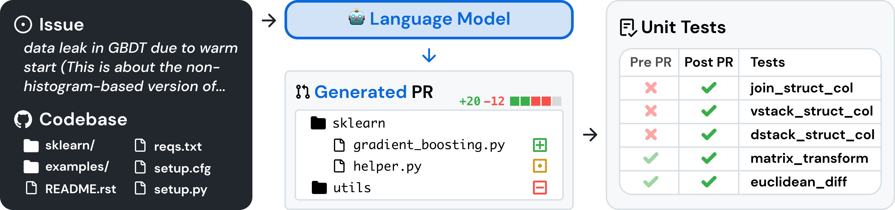

<p align="center">
  <a href="https://github.com/princeton-nlp/Llamao">
    
  </a>
</p>

<div align="center">

 | [日本語](docs/README_JP.md) | [English](https://github.com/princeton-nlp/SWE-bench) | [中文简体](docs/README_CN.md) | [中文繁體](docs/README_TW.md) |

</div>


---
<p align="center">
Code and data for our ICLR 2024 paper <a href="http://swe-bench.github.io/paper.pdf">SWE-bench: Can Language Models Resolve Real-World GitHub Issues?</a>
    </br>
    </br>
    <a href="https://www.python.org/">
        
    </a>
    <a href="https://copyright.princeton.edu/policy">
        
    </a>
    <a href="https://badge.fury.io/py/swebench">
        
    </a>
</p>

Please refer our [website](http://swe-bench.github.io) for the public leaderboard and the [change log](https://github.com/princeton-nlp/SWE-bench/blob/main/CHANGELOG.md) for information on the latest updates to the SWE-bench benchmark.

## 📰 News
* **[Apr. 15, 2024]**: SWE-bench has gone through major improvements to resolve issues with the evaluation harness. Read more in our [report](https://github.com/princeton-nlp/SWE-bench/blob/main/docs/20240415_eval_bug/README.md).
* **[Apr. 2, 2024]**: We have released [SWE-agent](https://github.com/princeton-nlp/SWE-agent), which sets the state-of-the-art on the full SWE-bench test set! ([Tweet 🔗](https://twitter.com/jyangballin/status/1775114444370051582))
* **[Jan. 16, 2024]**: SWE-bench has been accepted to ICLR 2024 as an oral presentation! ([OpenReview 🔗](https://openreview.net/forum?id=VTF8yNQM66))

## 👋 Overview
SWE-bench is a benchmark for evaluating large language models on real world software issues collected from GitHub.
Given a *codebase* and an *issue*, a language model is tasked with generating a *patch* that resolves the described problem.



To access SWE-bench, copy and run the following code:
```python
from datasets import load_dataset
swebench = load_dataset('princeton-nlp/SWE-bench', split='test')
```

## 🚀 Set Up
To build SWE-bench from source, follow these steps:
1. Clone this repository locally
2. `cd` into the repository.
3. Run `conda env create -f environment.yml` to created a conda environment named `swe-bench`
4. Activate the environment with `conda activate swe-bench`

## 💽 Usage
You can download the SWE-bench dataset directly ([dev](https://drive.google.com/uc?export=download&id=1SbOxHiR0eXlq2azPSSOIDZz-Hva0ETpX), [test](https://drive.google.com/uc?export=download&id=164g55i3_B78F6EphCZGtgSrd2GneFyRM) sets) or from [HuggingFace](https://huggingface.co/datasets/princeton-nlp/SWE-bench).

To use SWE-Bench, you can:
* Train your own models on our pre-processed datasets  
* Run [inference](https://github.com/princeton-nlp/SWE-bench/blob/main/inference/) on existing models (either models you have on-disk like LLaMA, or models you have access to through an API like GPT-4). The inference step is where you get a repo and an issue and have the model try to generate a fix for it.
* [Evaluate](https://github.com/princeton-nlp/SWE-bench/blob/main/swebench/harness/) models against SWE-bench. This is where you take a SWE-Bench task and a model-proposed solution and evaluate its correctness. 
*  Run SWE-bench's [data collection procedure](https://github.com/princeton-nlp/SWE-bench/blob/main/swebench/collect/) on your own repositories, to make new SWE-Bench tasks. 

## ⬇️ Downloads
| Datasets | Models |
| - | - |
| [🤗 SWE-bench](https://huggingface.co/datasets/princeton-nlp/SWE-bench) | [🦙 SWE-Llama 13b](https://huggingface.co/princeton-nlp/SWE-Llama-13b) |
| [🤗 "Oracle" Retrieval](https://huggingface.co/datasets/princeton-nlp/SWE-bench_oracle) | [🦙 SWE-Llama 13b (PEFT)](https://huggingface.co/princeton-nlp/SWE-Llama-13b-peft) |
| [🤗 BM25 Retrieval 13K](https://huggingface.co/datasets/princeton-nlp/SWE-bench_bm25_13K) | [🦙 SWE-Llama 7b](https://huggingface.co/princeton-nlp/SWE-Llama-7b) |
| [🤗 BM25 Retrieval 27K](https://huggingface.co/datasets/princeton-nlp/SWE-bench_bm25_27K) | [🦙 SWE-Llama 7b (PEFT)](https://huggingface.co/princeton-nlp/SWE-Llama-7b-peft) |
| [🤗 BM25 Retrieval 40K](https://huggingface.co/datasets/princeton-nlp/SWE-bench_bm25_40K) | |
| [🤗 BM25 Retrieval 50K (Llama tokens)](https://huggingface.co/datasets/princeton-nlp/SWE-bench_bm25_50k_llama)   | |

## 🍎 Tutorials
We've also written the following blog posts on how to use different parts of SWE-bench.
If you'd like to see a post about a particular topic, please let us know via an issue.
* [Nov 1. 2023] Collecting Evaluation Tasks for SWE-Bench ([🔗](https://github.com/princeton-nlp/SWE-bench/tree/main/tutorials/collection.md))
* [Nov 6. 2023] Evaluating on SWE-bench ([🔗](https://github.com/princeton-nlp/SWE-bench/tree/main/tutorials/evaluation.md))

## 💫 Contributions
We would love to hear from the broader NLP, Machine Learning, and Software Engineering research communities, and we welcome any contributions, pull requests, or issues!
To do so, please either file a new pull request or issue and fill in the corresponding templates accordingly. We'll be sure to follow up shortly!

Contact person: [Carlos E. Jimenez](http://www.carlosejimenez.com/) and [John Yang](https://john-b-yang.github.io/) (Email: {carlosej, jy1682}@princeton.edu).

## ✍️ Citation
If you find our work helpful, please use the following citations.
```
@inproceedings{
    jimenez2024swebench,
    title={{SWE}-bench: Can Language Models Resolve Real-world Github Issues?},
    author={Carlos E Jimenez and John Yang and Alexander Wettig and Shunyu Yao and Kexin Pei and Ofir Press and Karthik R Narasimhan},
    booktitle={The Twelfth International Conference on Learning Representations},
    year={2024},
    url={https://openreview.net/forum?id=VTF8yNQM66}
}
```

## 🪪 License
MIT. Check `LICENSE.md`.
