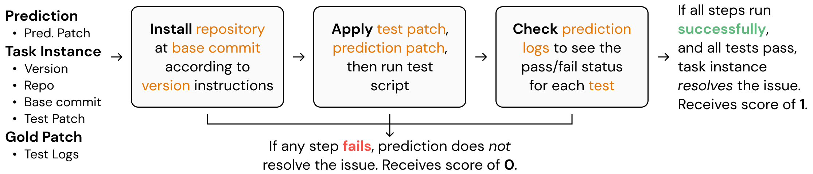
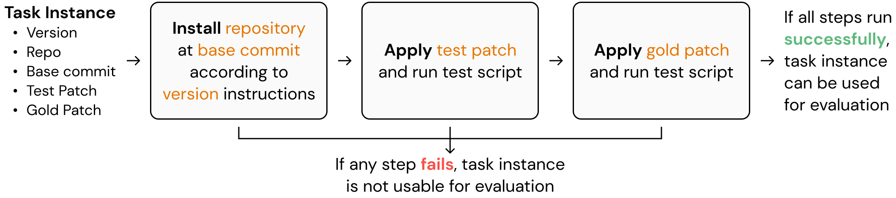

# Evaluation & Validation
This folder contains the code for...
1. **Evaluation**: Execute a model's patch generations against the corresponding task instances to determine whether or not it resolves the associated issue.
2. **Validation**: The third part of the benchmark construction procedure as described as in the paper, specifically 3. Execution-based filtering, which determines which candidate task instances are usable for evaluation purposes.

Below, we include 1. An overview of how the code works for each of these parts along with 2. How to invoke the validation and evaluation scripts.

## Evaluation
The `engine_evaluation.py` and `run_evaluation.py` code is used for evaluating models' patch generations on task instances.

The evaluation script generally performs the following steps:



the `run_evaluation.py` script is invoked using the `./run_evaluation.sh` script with the following arguments:
```
python run_evaluation.py \
    --predictions_path [Required] [.json]  Path to predictions \
    --log_dir          [Required] [folder] Path to directory to save evaluation log files \
    --swe_bench_tasks  [Required] [.json]  Path to SWE-bench task instances file \
    --testbed          [Required] [folder] Path to testbed directory, for cloning GitHub repos to \
    --skip_existing    [Optional] [bool]   Skip evaluating task instances with logs that already exist \
    --timeout          [Optional] [int]    Timeout for installation + test script execution \
    --verbose          [Optional] [bool]   Print verbosely
```

The `predictions_path`, `log_dir`, `swe_bench_tasks`, and `testbed` arguments are required. Other flags are not necessary for evaluation to run successfully, and are mainly for optimizing evaluation run time or defining alternate paths to write information to.

## Validation
The purpose of the `engine_validation.py` script is, given candidate task instances from the same repository, to determine which of them can then be used for evaluation purposes.

In the context of the collection pipeline, you should use this script after
1. Collecting candidate task instances (see `collect/` folder) and
2. Assigning version to each task instance and defining the installation procedure for each version (see `versioning/` folder).

The validation script generally performs the following steps:



The `engine_validation.py` script is invoked using the `./run_validation.sh` script with the following arguments:
```
python engine_validation.py \
    --instances_path  [Required] [.jsonl] Path to candidate task instances  \
    --log_dir         [Required] [folder] Path to directory to save validation log files \
    --num_workers     [Optional] [int]    Number of processes to parallelize on (Experimental^) \
    --path_conda      [Optional] [folder] Path to miniconda or anaconda installation \
    --testbed         [Optional] [folder] Path to testbed directory, for cloning GitHub repos to \
    --temp_dir        [Optional] [folder] Path to temporary directory
    --timeout         [Optional] [int]    Timeout for installation + test script execution \
    --verbose         [Optional] [bool]   Print verbosely
```
The `instances_path` and `log_dir` arguments are required. Other flags are not necessary for validation to run successfully,
and are mainly for optimizing validation run time or defining alternate paths to write information to.

`^`: The `num_workers` parallelization has not been rigorously tested. We will resolve this in near future versions.
