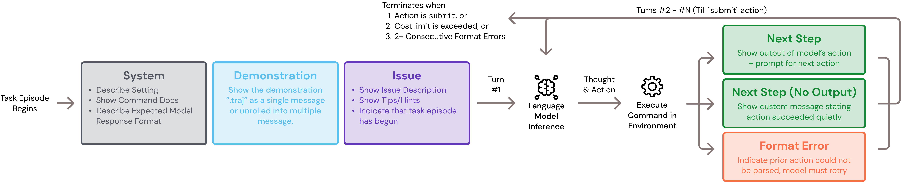

## Configuring templates

The following diagram illustrates where each template is shown within a single episode of solving one task instance.

One of three templates can be shown per turn:

* "Next Step" (`next_step_template`): Displayed if the model's action successfully runs. The output and a prompt for the next action is shown
* "Next Step (No Output)" (`next_step_no_output_template`): Displayed if the model's action successfully runs, but does not produce any standard output (e.g. `rm`, `cd`)
* "Format Error" (`format_error_template`): Displayed if the model's response is malformed. Over the next two turns...
  * If one of the model's next response is correct, the message history is updated such that the "Format Error" turn is not kept. The episode continues.
  * If the model's next two responses are both malformed, the episode terminates.

!!! tip "All options"
    See the [template reference](../reference/agent_config.md#sweagent.agent.agents.TemplateConfig) for all options.



