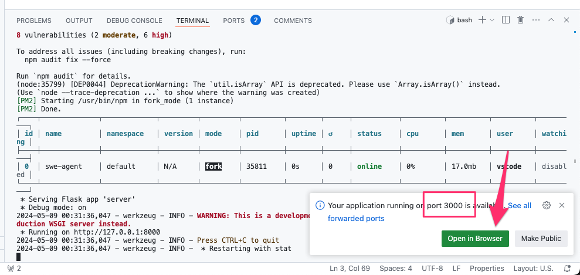

# Running SWE-agent in your browser

Running SWE-agent in your browser is the easiest way to try out our project.

<video controls>
<source src=" https://github.com/SWE-agent/SWE-agent/assets/13602468/44d60674-59ca-4986-9b22-7052a45cbed9" type="video/mp4">
</video>

1. Click [](https://codespaces.new/princeton-nlp/SWE-agent)
2. Add your language modelAPI keys to `.env` (find the file in the left sidebar and fill out the template). More information on the keys [here](keys.md).
3. Make sure to wait until the `postCreateCommand` in the terminal window at the bottom is finished
4. Enter your SWE-agent command, see, see  [using the command line](../usage/cl_tutorial.md).

## Running the Web UI

!!! warning "Web UI"
    We're currently working on updating the web UI to be compatible with the latest version of SWE-agent.
    Please use the [using the command line](../usage/cl_tutorial.md) until this is fixed.

Go to the terminal and enter

```bash
./start_web_ui.sh
```

After a while, you should see a popup offering you to forward port `3000`. Click `Open in Browser`.



If you instead only see the offer to forward port `8000`, do not click it (this is the port that's being used by the backend).

Instead, click on the `Ports` tab, and click on the globe next to port `3000`:


!!! tip "More information"
    See [running the web UI](../usage/web_ui.md) for more information about the
    web UI and additional hints for how to solve problems with the starting it.

