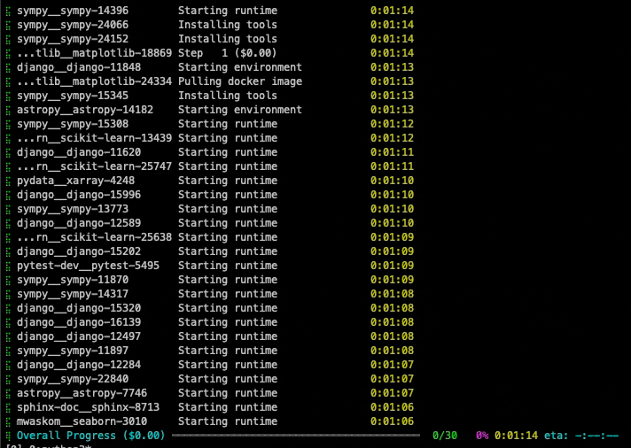

# Batch mode

!!! abstract "Running on many issues at once"
    You have used `sweagent run`. To become a real power user, we'll convert you to `sweagent run-batch` and you can run on a hundred issues at once.

    * Please make sure you're familiar with [the command line basics](cl_tutorial.md).
    * The default examples will be executing code in a Docker sandbox, so make sure you have docker installed ([docker troubleshooting](../installation/tips.md)).
      If you cannot run docker, skim through the examples below and adapt accordingly.

## A first example: SWE-bench

So you've decided to run SWE-agent on a lot of issues in parallel. Great, the `run-batch` command is exactly here for that.
Let's run on three [SWE-bench](https://www.swebench.com/) issues which will be downloaded automatically.

```bash
sweagent run-batch \
    --config config/default.yaml \
    --agent.model.name gpt-4o \
    --agent.model.per_instance_cost_limit 2.00 \
    --instances.type swe_bench \  # (1)!
    --instances.subset lite \  # (2)!
    --instances.split dev  \  # (3)!
    --instances.slice :3 \  # (4)!
    --instances.shuffle=True  # (5)!
```

1. There's a couple of built-in ways to configure instances. This option selects the SWE-bench dataset.
2. There's a few datasets provided by the SWE-bench project. Lite is a subset of GitHub issues with a few heuristic filters that makes them more likely to be solvable.
3. Most datasets have a `dev` and a `test` split.
4. The `--slice` option allows you to select a subset of instances from the dataset. It works just the way to pythons `list[...]` slicing, so you can specify `:10` to take the first 10 instances, `10:20` to take the next 10, `-10:` to take the last 10, or `10:20:2` to take every second instance in that range.
5. Shuffle all instances before slicing.

* There's some things that you should recognize: All of the `--agent` options are available and you can still specify `--config` files.
* However, the `--problem_statement`, `--repo`, and `--env` options obviously need to change, because you now want to populate these settings automatically from a source.

This is where the new option comes in: `--instances`, specifying the **instance source** together with a few options.

!!! tip "Tooltips"
    Click on the :material-chevron-right-circle: icon in the right margin of the code snippet to see more information about the line.

The output should remind you a lot like the output of the [hello world tutorial](hello_world.md), except for the progress bar at the bottom.
Kind of slow, isn't it?


!!! tip "All command line options"
    * See [`RunBatchConfig`](../reference/run_batch_config.md/#sweagent.run.run_batch.RunBatchConfig) for an overview of all options.
    * SWE-bench config: [`SWEBenchInstances`](../reference/batch_instances.md/#sweagent.run.batch_instances.SWEBenchInstances).

## Running in parallel

Let's speed things up and run on 5 instances at once. Only a single line to change:

```bash hl_lines="4-4"
sweagent run-batch \
    --config config/default.yaml \
    --agent.model.name gpt-4o \
    --num_workers 3 \
    --agent.model.per_instance_cost_limit 2.00 \
    --instances.type swe_bench \
    --instances.subset lite \
    --instances.split dev  \
    --instances.slice :3 \
    --instances.shuffle=True
```

You'll see output that looks like this (only with 3 workers instead of 30):

<figure markdown="span">
{: style="max-width: 500px; border-radius: 10px;"}
<figcaption>SWE-Agent running on 30 SWE-bench instances</figcaption>
</figure>

!!! tip "All command line options"
    See [`RunBatchConfig`](../reference/run_batch_config.md/#sweagent.run.run_batch.RunBatchConfig) for an overview of all options.

## Loading instances from a file

```bash
sweagent run-batch \
    --config config/default.yaml \
    --agent.model.name gpt-4o \
    --instances.type file \
    --instances.path instances.yaml  # (1)!
    --instances.slice :3 \
    --instances.shuffle=True
```

1. We support `.jsonl`, `.json`, and `.yaml` files.

Here'the simplest example of what such a file can look like

```yaml title="instances.yaml"
- image_name: "python:3.11"  # (1)!
  problem_statement: "A simple test problem"
  id: "simple_test_problem"
- image_name: "python:3.11"
  problem_statement: "Another test problem"
  id: "simple_test_problem_2"
```

1. Must be available locally or on dockerhub.

!!! tip "More options"
    * There's a few more fields that you can populate. See [`SimpleBatchInstances`](../reference/batch_instances.md/#sweagent.run.batch_instances.SimpleBatchInstance) for more information.
    * For all command line options with this instance type, see [`InstancesFromFile`](../reference/batch_instances.md/#sweagent.run.batch_instances.InstancesFromFile).

## Huggingface instances

If you upload your dataset to Huggingface in a similar style as the example we just saw, you can load it like this:

```bash
sweagent run-batch \
    ...
    --instances.type huggingface \
    --instances.dataset_name "your_username/your_dataset" \
    --instances.split "dev" \
    --instances.slice :3 \
    --instances.shuffle=True
```

!!! tip "All instance options"
    See [`InstancesFromHuggingFace`](../reference/batch_instances.md/#sweagent.run.batch_instances.InstancesFromHuggingFace).

## Expert instances

If this is not enough for your use case, you can also specify a full set of `Environment`, `ProblemStatement`, and `Repository` config objects:

```bash
sweagent run-batch \
    ...
    --instances.type expert_file \
    --instances.path instances.yaml
```

where `instances.yaml` could look like this:

```yaml title="instances.yaml"
- env:
    deployment:
      type: docker
      image: python:3.11
  problem_statement:
    type: text
    text: "A simple test problem"
    id: "simple_test_problem"
  repo:
    type: github
    github_url: "https://github.com/swe-agent/test-repo"
- env:
    deployment:
      type: docker
      image: python:3.11
  problem_statement:
    type: text
    text: "A simple test problem 2"
    id: "simple_test_problem_2"
```

!!! tip "All instance options"
    See [`ExpertInstances`](../reference/batch_instances.md/#sweagent.run.batch_instances.ExpertInstancesFromFile).

## Output files and next steps

