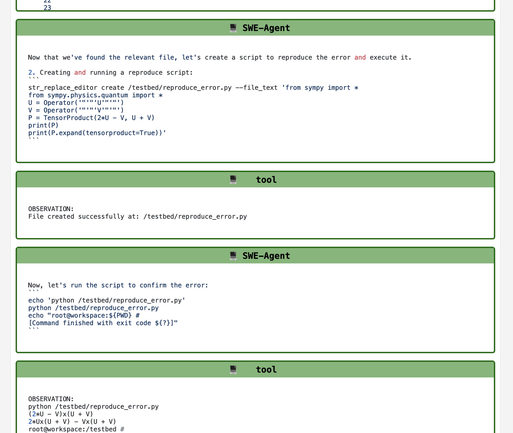

# Inspecting trajectories

!!! abstract "Inspecting trajectories"
    * Trajectories are the main output of SWE-agent. They are the best way to understand what SWE-agent does, especially when running on many problem instances.
    * We provide a web interface for visualizing [`.traj` files](trajectories.md) from the `trajectories` folder more easily.
    * Please complete the [hello world](hello_world.md) tutorial before proceeding.

You should see a folder called `trajectories` in your working directory. Let's go to one of the *experiment directories*:

```bash
cd trajectories/$USER/<some directory>  # (1)!
```

1. Don't have a folder here? Make sure to run SWE-agent at least once.

Run the inspector in this directory (this is where your `*.traj` files are):

```bash
sweagent inspector
```
The inspector will then be launched in the browser:

{: style="width: 49%;"}
{: style="width: 49%;"}

**Additional flags**

- `--directory`: Directory of trajectories to inspect (Defaults to current directory)
- `--port`: Port to host web app (Defaults to `8000`).

## Benchmark results

If you are running SWE-agent on a benchmark (see [benchmarking](benchmarking.md)), you will see evaluation results as ✅ or ❌.
Otherwise, you will see ❓.

!!! tip
    * If you do not see evaluation results, make sure that the SWE-bench output
      is called `results.json` and is in the same directory as the trajectories.
    * To see gold patches, point `--data_path` to the SWE-bench dataset.



